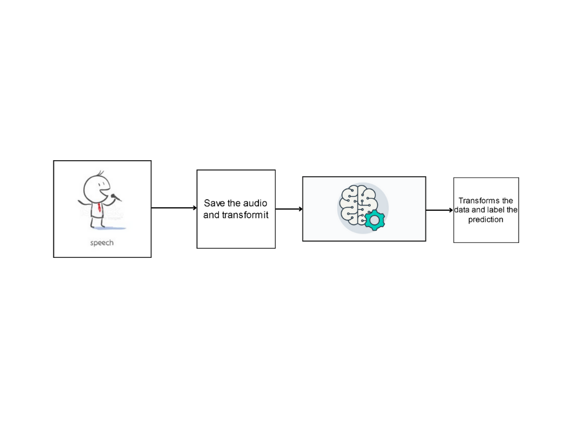
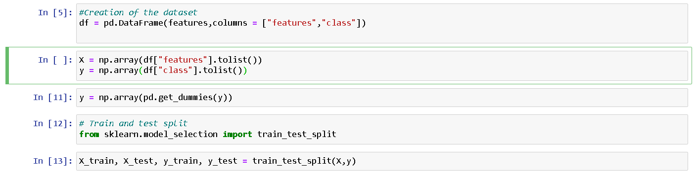
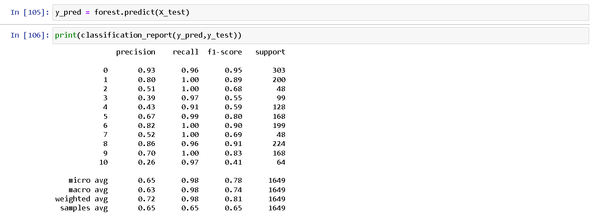
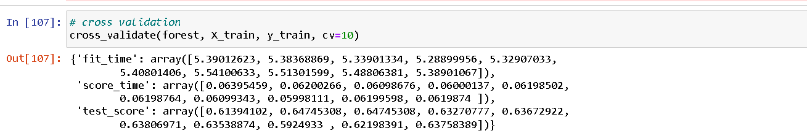
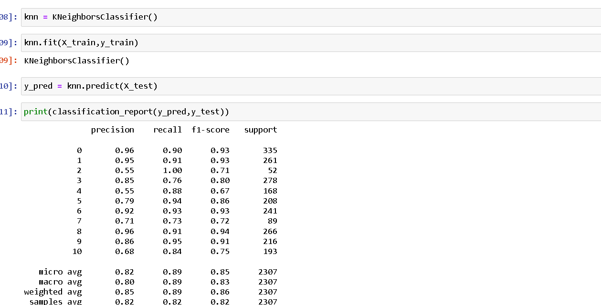
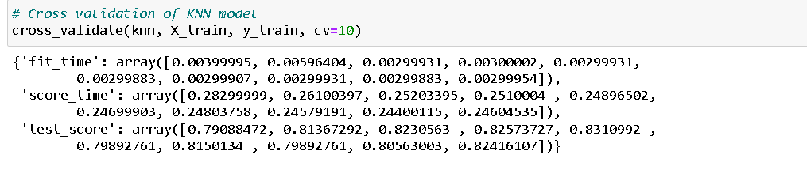
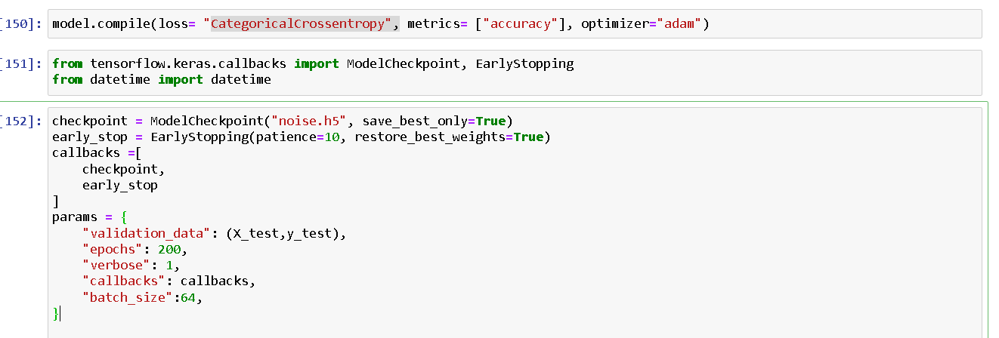
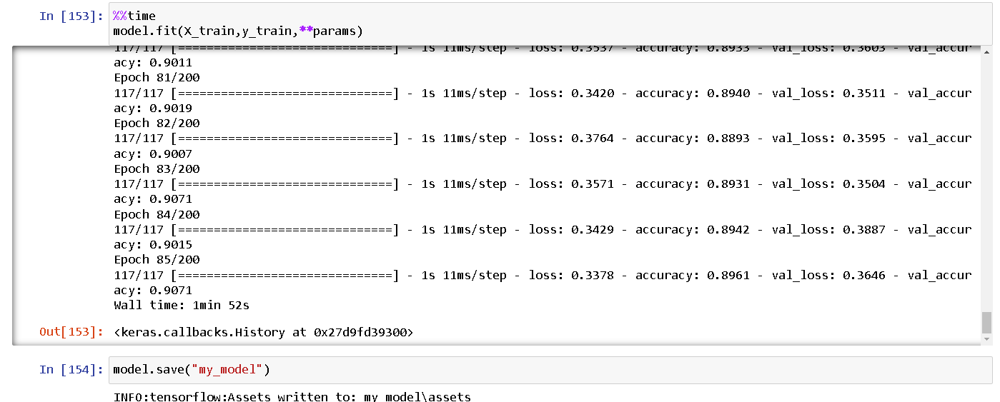
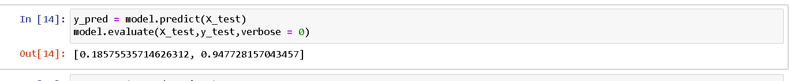

# Noise Recognition: Audio Events
Project about a model and a [Dashboard](https://share.streamlit.io/fedetorres210/noise-recognition/main/dashboard/main.py) focused on noise recognition.

## Table of Content
---
- [Description](#Description)
- [Tecnologies](#Tecnologies)
    - [Datasets](#Datasets)
    - [Important Libraries](#Important-Libraries)
- [Creation procces](#Creation-procces)
    - [Data preparation](#Data-preparation)
    - [Machine learning Training](#Machine-learning-Training)
    - [Neural Network model](#Neural-Network-model)
    - [Audio recording](#Audio-recording)
    - [Model Complications](#Model-Complications)
    - [Future Development](#future-development)
    
- [Installation](#Installation)
    - [Steps](#Steps)
    - [Server run](#Server)
- [Similar Projects](#Similar-projects)
- [Documentation and Contact](#Documentation-and-Contact)
---
  

## Description
---

 The idea of ​​this project is to create a model that is capable of recognizing the different sounds in an environment. In order to find this model, different models will be used, looking for the one that works best, at the same time the TensorFlow library will be used to create a neural network and compare if the model is better than said network. On the other hand it will be use a dashboard for deploying the model and neural network.

 In this document we will see the progress and future ideas of the project, this also means that the project is still in development

----
## Tecnologies

### Datasets
---
#### **UrbanSound8K Dataset**

This dataset contains 8732 labeled sound excerpts (<=4s) of urban sounds from 10 classes: air_conditioner, car_horn, children_playing, dog_bark, drilling, enginge_idling, gun_shot, jackhammer, siren, and street_music. The classes are drawn from the urban sound taxonomy. For a detailed description enter the following links:   
* <https://urbansounddataset.weebly.com/urbansound8k.html>
* <http://www.justinsalamon.com/uploads/4/3/9/4/4394963/salamon_urbansound_acmmm14.pdf>
---

#### **Isolated Urban Sound**

The Isolated urban sound database contains the audio samples used to design urban sound mixtures using SimScene software.
https://zenodo.org/record/1213793#.YiYcAHrMKUl

--- 
#### **CitySounds2017train audio files**

The CitySounds2017train dataset comprising 1100 1-minute .wav audio files recorded at 44 green infrastructure sites within Greater London, UK between 2013 and 2015.

###  Important Libraries
---
#### **Librosa**

[librosa](https://librosa.org/doc/latest/index.html) is a python package for music and audio analysis. It provides the building blocks necessary to create music information retrieval systems.

---
#### **TensorFlow**

[TensorFlow](https://www.tensorflow.org/api_docs/python/tf) is an end-to-end open source platform for machine learning

---
#### **Keras**

[Keras](https://www.tensorflow.org/guide/keras?hl=es-419) is TensorFlow's high-level API for building and training deep learning models. It is used for rapid prototyping, cutting-edge (state-of-the-art) research, and in production.

---
#### **SoundDevice**

[SoundDevice](https://python-sounddevice.readthedocs.io/) is a  Python module that  provides bindings for the PortAudio library and a few convenience functions to play and record NumPy arrays containing audio signals.

---
#### **Streamlit**

[Streamlit](https://docs.streamlit.io/) is an open-source Python library that makes it easy to create and share beautiful, custom web apps for machine learning and data science.

#### **Numpy**

[Numpy](https://numpy.org/doc/stable/) is the fundamental package for scientific computing with Python

---

## Creation procces

### Data preparation
---
As said before, the main idea was to create a model that was capable of recognizing urban sounds. To achieve this, 3 datasets were implemented. Next, we will see some problems and the treatment given to each one.

[Urban Sound 8K](#UrbanSound8K-Dataset): This dataset contains 8732 labeled in 10 classes from Urban sounds.

[Isolated Urban Sound and CitySounds2017train](#datasets): This audio files were used to create the eleventh class named background.

To implement correctly the labeling it was created 2 functions on python:

---

**This function uses the [librosa](https://librosa.org/doc/main/generated/librosa.load.html) library to load a single file and transforms it with a [method](https://librosa.org/doc/main/generated/librosa.feature.mfcc.html)** 

    def extractor(file):
        audio, sample_rate = librosa.load(file, res_type= "kaiser_fast")
        mfccs_transformed = librosa.feature.mfcc(y=audio, sr = sample_rate, n_mfcc=50)
        mfccs_scaled = np.mean(mfccs_transformed.T, axis=0)
        return mfccs_scaled

**This function uses the [extractor function](), the [Urban Sound8k csv](backend/source/audio_files/noise_dataset.csv), the [Isolated Urban sound](#datasets) and the [CitySounds2017train](#citysounds2017train-audio-files) to label the files with the 11 desired categories and transforms it** 

    def feature_creator(path_1= noise_path,path_2=background_path,df=noise_dataset):
        features = []
        for index_num,row in df.iterrows():
            file_name = os.path.join(os.path.abspath(path_1),'fold'+str(row["fold"])+'/',str(row["slice_file_name"]))
            final_class_labels=row["class"]
            data= extractor(file_name)
            features.append([data,final_class_labels])

        for elem in os.listdir(path_2):
            file = os.path.join(os.path.abspath(path_2),elem)
            mccfs = extractor(file)
            features.append([mccfs, "Background"])
        print(f"{len(features)} sounds loaded")
        return features

After this the dataset was created and  divided between X and y, also the [pandas](https://pandas.pydata.org/docs/reference/api/pandas.get_dummies.html) librarie was implemented to create categorie classes in the y.

Last but not least the X and y was divided with the [sklearn librarie](#important-libraries) on train and test.

### **Machine learning Training**
---
This was a  multi class classification problem so it was needed a model capable of doing the classification, like the [KNeighborsClassifier](https://scikit-learn.org/stable/modules/generated/sklearn.neighbors.KNeighborsClassifier.html) or the [RandomForestClassifier](https://scikit-learn.org/stable/modules/generated/sklearn.ensemble.RandomForestClassifier.html)

#### **Random Forest Metrics**
---

#### **Cross validation**
---

#### **KNeighborsClassifier metrics**
---

#### **Cross validation**
---

### **Neural Network model**
---
For the implementation of a neural network it was decided to use a sequential model with 4 layers, the first 3 with 750 neurons and the final with the 11 possible layers

    Model: "sequential_9"
    _________________________________________________________________
    Layer (type)                Output Shape              Param #   
    =================================================================
    dense_37 (Dense)            (None, 750)               38250     
                                                                    
    activation_37 (Activation)  (None, 750)               0         
                                                                    
    dropout_28 (Dropout)        (None, 750)               0         
                                                                    
    dense_38 (Dense)            (None, 750)               563250    
                                                                    
    activation_38 (Activation)  (None, 750)               0         
                                                                    
    dropout_29 (Dropout)        (None, 750)               0         
                                                                    
    dense_39 (Dense)            (None, 750)               563250    
                                                                    
    activation_39 (Activation)  (None, 750)               0         
                                                                    
    dropout_30 (Dropout)        (None, 750)               0         
                                                                    
    dense_40 (Dense)            (None, 11)                8261      
                                                                    
    activation_40 (Activation)  (None, 11)                0  

**It was implemented the [CategoricalCrossentropy](https://www.tensorflow.org/api_docs/python/tf/keras/metrics/categorical_crossentropy) in the compilation of the model with the [Adam](https://keras.io/api/optimizers/adam/) optimizer.**

**Model training and saving**

#### **Metrics**
---

### **Audio recording**
---
It was needed a recording function to get real time predictions so it was implemented 3 functions with the [sounddevice libraries](https://python-sounddevice.readthedocs.io/en/0.4.4/)

**Function that reads the audio**

    def read_audio(file):
        with open(file, "rb") as audio_file:
            audio_bytes = audio_file.read()
        return audio_bytes

**Function that records the audio using sounddevice**

    def record(duration=5, fs=48000):
        sd.default.samplerate = fs
        sd.default.channels = 1
        sd.default.device = 0
        myrecording = sd.rec(int(duration * fs))
        sd.wait(duration)
        return myrecording

**Function that saves the recorded audio with wavio**

    
    def save_record(path_myrecording, myrecording, fs):
        wavio.write(path_myrecording, myrecording, fs, sampwidth=2)
        return None

### **Model Complications**
---

1. Audio samples (short audios, similiar sounds, more sounds needed)
2. More classes to identify new environments

### **Future development**
---
1. Implementation of **new audio** file and features to get a better model.
2. Implementation of **new classes** to recognise the situations and the other environments
3. Web real time predictions.

---

## Installation
---
###  Steps

    $git init

    $git clone https://github.com/Fedetorres210/Noise-recognition.git

    $ pip install -r requirements.txt
It's necesary to have installed all the libraries of the requirements.txt file. Once have installed all, the server can be started.

### Server 
---
To run the dashboard, in the same level where you have the file [main.py](dashboard/main.py) , the next command:

    streamlit run main.py

### Docker
---
For this project is posible to create a image of docker on your computer and run it on local host.

First of all its necesary to have [docker](https://www.docker.com/) installed on your computer and running.

    $docker ps

Now you have to go to the [dashboard](dashboard/) file and run the following commands:

    $Docker build -t streamlitdashboard:latest .

    $docker run -p 8501:8501 streamlitdashboard:latest

---
## Similar projects 
---
### Urban street noise recogniton 
http://sedici.unlp.edu.ar/bitstream/handle/10915/23897/Documento_completo.pdf?sequence=1  
### Urban Sound 8K example
https://github.com/krishnaik06/Audio-Classification
   

## Documentation and Contact
- McFee, Brian, Colin Raffel, Dawen Liang, Daniel PW Ellis, Matt McVicar, Eric Battenberg, and Oriol Nieto. “librosa: Audio and music signal analysis in python.” In Proceedings of the 14th python in science conference, pp. 18-25. 2015.
- Justin Salomon -  <jpbello@nyu.edu>
- Fairbrass, Alison (2018): CitySounds2017train audio files. figshare. Dataset. https://doi.org/10.6084/m9.figshare.5886532.v1 
- Rodríguez, Yohanna; Ballesteros L, Dora Maria; Renza, Diego (2019), “Fake voice recordings (Imitation)”, Mendeley Data, V1, doi: 10.17632/ytkv9w92t6.1
- 
- Krishnaik: https://github.com/krishnaik06
- Fairbrass, Alison (2018): CitySounds2017train audio files. figshare. Dataset. https://doi.org/10.6084/m9.figshare.5886532.v1 
- Federico Torres Lobo - Creator

